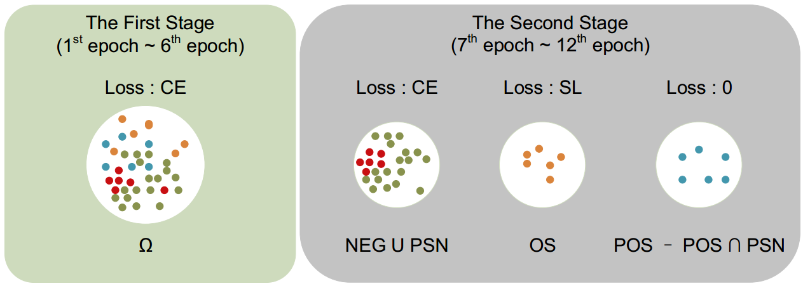
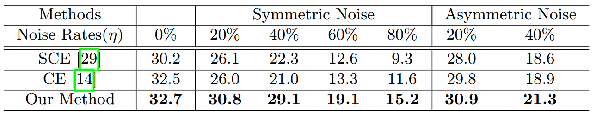
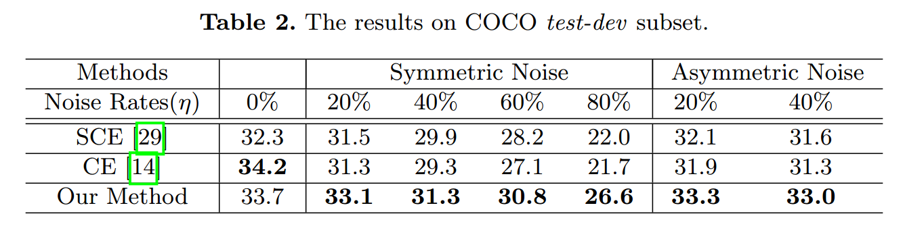

# Learning-with-Noisy-Class-Labels-for-Instance-Segmentation
The project about 'Learning with Noisy Class Labels for Instance Segmentation'.

## 1. Introducton

Instance segmentation has achieved siginificant progress in the presence of correctly annotated datasets. Yet, object classes in largescale datasets are sometimes ambiguous, which easily causes confusion. In addition, limited experience and knowledge of annotators can also lead to mislabeled object classes. To solve this issue, a novel method is proposed in this paper, which uses different losses describing different roles of noisy class labels to enhance the learning. Specifically, in instance segmentation, noisy class labels play different roles in the foregroundbackground sub-task and the foreground-instance sub-task. Hence, on the one hand, the noise-robust loss (e.g., symmetric loss) is used to prevent incorrect gradient guidance for the foreground-instance sub-task. On the other hand, standard cross entropy loss is used to fully exploit correct gradient guidance for the foreground-background sub-task.



The project is based on mmdetection v2.2.0. Main results in the paper are based on older mmdetection (v1.0rc0).

## 2. Main Results

On Cityscapes dataset:



On COCO dataset:



## 3. Usage
### 3.1. Installtion

  Please check [install.md](docs/install.md) for installation instructions.

### 3.2. Data Generation

  For symmetric noise:
  1. Open the file [noisy_labels_SN_Cityscapes.py](/noisy_labels_SN_Cityscapes.py).
  2. Modify the noise rate r and the annotation path p.
  3. Run the file [noisy_labels_SN_Cityscapes.py](/noisy_labels_SN_Cityscapes.py).
  
  For asymmetric noise:
  1. Open the file [noisy_labels_AN_Cityscapes.py](/noisy_labels_AN_Cityscapes.py).
  2. Modify the noise rate r and the annotation path p.
  3. Run the file [noisy_labels_AN_Cityscapes.py](/noisy_labels_AN_Cityscapes.py).
  
  Similarly, noise under other datasets can be set.

### 3.3. Stage-wise Training

  For Cityscapes dataset:
  1. For the first stage, models should be trained with the config [mask_rcnn_r50_fpn_1x_cityscapes_nl_1.py](/configs/cityscapes/mask_rcnn_r50_fpn_1x_cityscapes_nl_1.py).
  2. For the second stage, models should be trained with the config [mask_rcnn_r50_fpn_1x_cityscapes_nl_2.py](/configs/cityscapes/mask_rcnn_r50_fpn_1x_cityscapes_nl_2.py) like this:
  ```shell
  ./tools/dist_train.sh ${CONFIG_FILE} ${GPU_NUM} --resume-from ${MODEL_PATH}
  ```
  The second stage needs use the model trained in the stage.
  
  Other datasets should apply similar settings.

### 3.4. Evaluation
  
  Please check [getting_started.md](docs/getting_started.md) for details.

## 4. Designed Loss

  1. Our designed loss is provided in [new_combination_loss.py](/mmdet/models/losses/new_combination_loss.py). 
  2. Symmetric cross entropy loss is provided in [symmetric_cross_entropy_loss.py](/mmdet/models/losses/symmetric_cross_entropy_loss.py) 
  3. Generalized cross entropy loss is provided in [generalized_cross_entropy_loss.py](/mmdet/models/losses/generalized_cross_entropy_loss.py).

## 5. Contact

  My email is released in the paper.
